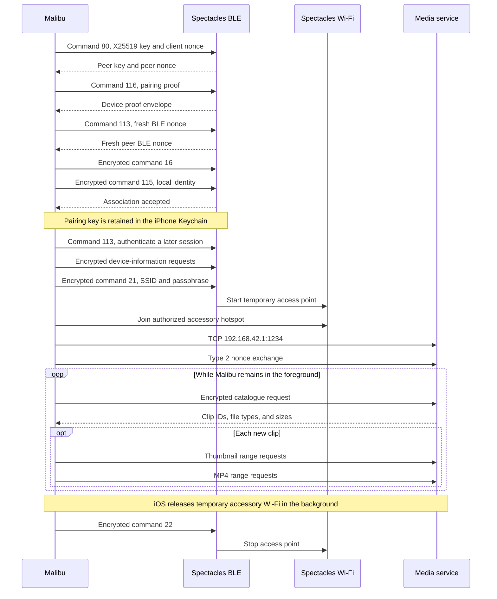

# Spectacles 2 reverse-engineered protocol

This document describes the subset of the 2018 Spectacles 2 protocol implemented by Malibu. It is an independent interoperability specification derived from observed device traffic, behavior of the legacy client, controlled experiments, and repeatable test vectors. It is not an official Snap specification.

The implementation has been exercised against one Spectacles 2 Original frame. Fields marked **observed** were confirmed on that hardware. Fields marked **derived** were reconstructed from client behavior or cryptographic traces. Fields marked **Malibu** are choices made by this project and are not requirements of the glasses.

## System overview

Spectacles 2 use two transports:

1. Bluetooth Low Energy carries discovery, pairing, session authentication, and Wi-Fi control.
2. A temporary 2.4 GHz Wi-Fi access point carries the media catalogue, thumbnails, and MP4 data over TCP.

Both transports use the same 16-byte key created during pairing. Each connection negotiates fresh per-direction AES-GCM nonces.



Apple AccessorySetupKit is used only to authorize Bluetooth and Wi-Fi access on iOS. It does not change the Spectacles wire protocol.

The Bluetooth identifier exposed by AccessorySetupKit is app-scoped and may change after re-signing or reinstalling Malibu. The encryption key, local user identity, and stable Spectacles network name remain valid. Before opening Core Bluetooth, Malibu matches the authorized `ASAccessory` by the stored SSID, reads its current `bluetoothIdentifier`, and updates the Keychain record if needed. This keeps iOS authorization and the protocol pairing identity synchronized without repeating the key exchange.

## How the protocol was reconstructed

The reverse-engineering process used several independent sources of evidence:

- BLE advertisements and GATT traffic identified the pairing marker, service, characteristics, frame boundaries, and request order.
- The retired mobile client revealed protobuf field structure and the media file-type values after static inspection.
- Runtime traces through the legacy native pairing component exposed the X25519 inputs, nonce placement, key derivation, and proof input layout.
- A Windows Python prototype was used to replay individual commands, vary fields, and confirm which responses came from the glasses.
- Known-input test vectors were added for AES-GCM framing, protobuf encoding, and the pairing proof path.
- Successful catalogue reads and byte-range downloads confirmed the media hierarchy and file-size semantics.

The protocol was reconstructed from the outside in. Transport framing was solved first, then the command envelope, protobuf fields, security state, media session, and file operations. Unknown fields were left unnamed rather than assigned speculative meanings.

## Bluetooth discovery

### Pairing mode

Holding the only button for about seven seconds and releasing it makes the glasses advertise their pairing state for a limited period.

The manufacturer-specific advertisement payload contains ASCII `050`:

```text
30 35 30
 0  5  0
```

Some platforms include the two-byte manufacturer identifier `c2 03` before the payload. Malibu removes that prefix before comparing the remaining bytes with `30 35 30`.

Outside pairing mode, Malibu reconnects by the operating system's saved Bluetooth peripheral UUID. A local name beginning with `Specs` is used only as a discovery fallback.

### GATT profile

| Role | UUID |
| --- | --- |
| Service | `0000FE45-0000-1000-8000-00805F9B34FB` |
| Client write, with response | `6E400002-B5A3-F393-E0A9-E50E24DCCA9E` |
| Device notification | `6E400003-B5A3-F393-E0A9-E50E24DCCA9E` |

Malibu enables notifications before sending commands. Outgoing frames are split into writes no larger than the peripheral's reported write limit, capped at 20 bytes for compatibility. Incoming notifications are an arbitrary byte stream: one notification can contain part of a frame, one frame, or several frames. A receiver must buffer and reassemble them.

## Bluetooth framing

Every Bluetooth message begins with a four-byte outer header.

| Offset | Size | Encoding | Meaning |
| --- | ---: | --- | --- |
| `0` | 1 | unsigned byte | Frame kind |
| `1` | 3 | little-endian | Body length, excluding the header |
| `4` | variable | bytes | Plaintext or AES-GCM packet |

The 24-bit length permits values below `2^24`. Malibu rejects bodies larger than 16 MiB before allocating or parsing them.

### Frame kinds

| Kind | Direction | Security | Handling |
| ---: | --- | --- | --- |
| `0` | Device to client | Plaintext | Unsolicited event or notification |
| `1` | Either | Plaintext | Command request or command response |
| `4` | Device to client | Encrypted | Unsolicited event or notification |
| `5` | Either | Encrypted | Command request or command response |

Kinds `4` and `5` contain `ciphertext || tag` in the outer body. After decryption, their inner format is identical to the corresponding plaintext kind.

### Command request body

| Offset | Size | Encoding | Meaning |
| --- | ---: | --- | --- |
| `0` | 2 | little-endian | Command number |
| `2` | 1 | byte | Reserved, sent as zero |
| `3` | variable | protobuf | Command-specific payload |

### Command response body

| Offset | Size | Encoding | Meaning |
| --- | ---: | --- | --- |
| `0` | 1 | byte | Status, zero means success |
| `1` | 2 | little-endian | Echoed command number |
| `3` | 1 | byte | Reserved |
| `4` | variable | protobuf | Command-specific response |

For example, this successful response to command 80 was observed during pairing. The 52-byte protobuf payload begins at the first `0a` after the response envelope:

```text
01 38 00 00  00 50 00 00  0a 10 ... 12 20 ...
|  |          |  |     |   |
|  |          |  |     |   protobuf fields
|  |          |  |     reserved
|  |          |  command 0x0050
|  |          status 0
|  body length 56
kind 1
```

Malibu permits one outstanding BLE command at a time and matches a response by its echoed command number.

## Protobuf encoding

Command payloads use standard protobuf wire encoding without a published schema. Malibu implements the subset required by the observed messages:

| Wire type | Meaning | Malibu behavior |
| ---: | --- | --- |
| `0` | Varint | Read and write |
| `1` | 64-bit | Skip when parsing |
| `2` | Length-delimited bytes, strings, or nested messages | Read and write |
| `5` | 32-bit | Skip when parsing |

The field key is encoded as the varint `(field_number << 3) | wire_type`. Integers are unsigned protobuf varints. Strings are UTF-8 bytes in a length-delimited field. Nested messages are length-delimited byte fields parsed again as protobuf.

Unknown supported fields are ignored. Truncated fields, malformed varints, and unsupported wire types are rejected.

## Pairing and key establishment

Pairing begins while the `050` marker is advertised. The following sequence is required by the tested firmware.

### Command 80: X25519 exchange

Command 80 is sent in plaintext kind `1`.

Request payload:

| Field | Type | Length | Meaning |
| ---: | --- | ---: | --- |
| `1` | bytes | 16 | Random client pairing nonce `Nc` |
| `2` | bytes | 32 | Client X25519 public key `Pc` |

Response payload:

| Field | Type | Length | Meaning |
| ---: | --- | ---: | --- |
| `1` | bytes | 16 | Spectacles pairing nonce `Ns` |
| `2` | bytes | 32 | Spectacles X25519 public key `Ps` |

The client generates a fresh X25519 private key `sc` and computes:

```text
S = X25519(sc, Ps)
```

`S` is a 32-byte shared secret.

### Pairing packet key derivation

The persistent packet key is derived as:

```text
Kfull = HMAC-SHA256(key = S, message = ASCII("v2"))
K = Kfull[0:16]
```

`K` is the 16-byte AES key used by later BLE and media sessions. Malibu stores `K` in the iPhone Keychain after the complete pairing sequence succeeds.

### Pairing proof derivation

The client proof is a deterministic 28-byte result derived from `Nc`, `Ns`, and `S` by the recovered proof routine:

```text
proof = PairingProof(Nc, Ns, S)
message = proof[0:12]
tag = proof[12:28]
```

The proof operation receives the following reconstructed inputs:

```text
state = Nc || Ns || S
input = Ns || S || 05 09 16 17 || ASCII("Msg1") || 00 00 00 00
constant = ASCII("Snapchat") || 00 00 00 00
```

The compatibility program uses the `SPVM` container:

| Offset | Size | Encoding | Meaning |
| --- | ---: | --- | --- |
| `0` | 4 | ASCII | `SPVM` magic |
| `4` | 4 | little-endian | Format version, currently `1` |
| `8` | 4 | little-endian | Original module base address |
| `12` | 4 | little-endian | Module byte length |
| `16` | 4 | little-endian | Proof entry address |
| `20` | 4 | little-endian | Reserved source address field |
| `24` | 4 | little-endian | Decoded instruction count |
| `28` | variable | bytes | Module data followed by fixed 108-byte instruction records |

The executor models a bounded 32-bit ARM state with 16 registers, condition flags, a 64 KiB work region, and a 64 KiB stack region. Memory access is restricted to the recovered module and those two regions. It supports only the instruction forms reached by the proof routine and stops after at most one million instructions. The public API returns the 12-byte message followed by the 16-byte tag.

The repository includes a fixed known-input vector for this operation. It prevents changes to the VM, input layout, or byte order from silently changing the proof.

### Command 116: mutual proof exchange

Command 116 is sent in plaintext kind `1`.

Request payload:

| Field | Type | Meaning |
| ---: | --- | --- |
| `1` | bytes | 16-byte client proof tag |
| `2` | bytes | 12-byte client proof message |

Response payload:

| Field | Type | Meaning |
| ---: | --- | --- |
| `1` | bytes | 16-byte device tag |
| `2` | bytes | Device attestation message |

The tested firmware returned a certificate-bearing device message of 796 bytes. Malibu accepts messages from 256 through 4096 bytes because certificate data can vary by firmware. It checks the envelope and tag sizes. It does not currently validate the complete device certificate chain, so the first successful encrypted exchange is also used as confirmation that both sides derived the same session key.

### Command 113: initialize packet security

Command 113 creates fresh AES-GCM state. It is used immediately after pairing and at the beginning of every later BLE session.

The command itself is plaintext.

Request payload:

| Field | Type | Length | Meaning |
| ---: | --- | ---: | --- |
| `1` | bytes | 16 | Fresh client transmit nonce `Tc` |

Response payload:

| Field | Type | Length | Meaning |
| ---: | --- | ---: | --- |
| `1` | bytes | 16 | Fresh device transmit nonce `Ts` |

After the response:

```text
client transmit key   = K
client transmit nonce = Tc
client receive key    = K
client receive nonce  = Ts
```

Subsequent commands use encrypted kind `5` until the BLE connection ends.

### Command 16: serial number and encrypted key confirmation

Command 16 has no protobuf payload. It returns the device serial number as bytes in response field `1`. The legacy client converts those bytes to uppercase hexadecimal and accepts exactly 16 hexadecimal characters on Spectacles 2.

Malibu also sends command 16 as the first encrypted request after command 113 during pairing. Successfully decrypting its response demonstrates that the glasses accepted `K` and the negotiated nonce state. The pairing path does not need to retain the serial number.

### Command 115: associate the client identity

Request payload:

| Field | Type | Meaning |
| ---: | --- | --- |
| `1` | bytes | UTF-8 local user identifier |

Malibu's identifier is 32 lowercase hexadecimal characters generated from 16 random bytes. The response must contain varint field `1` equal to `1`.

The identifier is local to the installation. It is not a Snapchat username or account identifier.

## Device information commands

The retired Spectacles 2 client requests battery, charger, serial, firmware, frame color, and storage data after BLE authentication. Static inspection maps each request to a 16-bit command number and maps the protobuf response type. Malibu reproduces that sequence after command 113. These fields are **derived** from the client and should be tested across more firmware versions.

All requests in this section use encrypted frame kind `5` and a zero reserved byte.

### Command 42: battery status

Request protobuf:

| Field | Type | Malibu value | Meaning |
| ---: | --- | ---: | --- |
| `1` | varint | `1` | Main battery selector |

Response protobuf:

| Field | Type | Meaning |
| ---: | --- | --- |
| `1` | varint | Raw battery percentage |
| `2` | varint | Unknown |
| `3` | signed int32 varint | Battery temperature in degrees Celsius |
| `4` | varint | Unknown |
| `5` | enum varint | Unknown battery state |
| `6` | enum varint | Unknown battery condition |

The legacy client presents the battery value as:

```text
displayed_percent = clamp(floor(raw_percent / 0.95), 0, 100)
```

Malibu uses the same conversion so its value matches the original client.

### Command 106: charger state

Command 106 has no payload. Response field `1` is a boolean and is true while a charger is connected. Response fields `2` through `6` exist in the recovered schema, but their meanings have not been assigned because the evidence is incomplete.

### Command 0: firmware version

Command 0 has no payload. Its response contains strings in fields `1`, `2`, and `3`, plus optional strings in fields `4` and `5` and an optional unsigned integer in field `6`. The Spectacles 2 client uses field `3` as the firmware version shown for Malibu and Neptune hardware.

### Command 37: frame color

Command 37 has no payload. Response field `1` is an enum:

| Value | Frame |
| ---: | --- |
| `0` | Onyx |
| `1` | Ruby |
| `2` | Sapphire |
| `3` | Veronica |
| `4` | Nico |

Response field `2` is an optional unsigned integer with an unknown meaning.

### Command 150: storage percentage

Command 150 has no payload. Response field `1` is an unsigned integer used by the legacy client as device storage percentage. Malibu presents it as storage used and clamps the displayed value to the range from 0 through 100.

### Optional and unused status requests

The recovered client also contains command 195, named `GetGuppyBatteryStatus`, and command 163, named `GetAvailableStorage`. Malibu does not expose either one yet because the Guppy subsystem label and the byte-count semantics of the available-storage response have not been confirmed on the test hardware.

## AES-GCM packet format

BLE and media encryption share the same packet construction.

```text
packet = AES-128-GCM(K, nonce, plaintext, additional_data = empty)
wire_body = ciphertext || 16-byte authentication_tag
```

The 16-byte nonce is not transmitted with each packet. Each direction begins with the nonce exchanged during session setup and maintains its own counter.

After every successful encryption or decryption, increment the full 16-byte nonce as an unsigned big-endian integer:

```text
00 00 ... 00 ff  ->  00 00 ... 01 00
```

Transmit and receive counters advance independently. Reusing a session after losing one packet will desynchronize the counters, so Malibu discards the connection and negotiates fresh nonces when retrying.

No separate checksum is present. AES-GCM authenticates the ciphertext and detects corruption or a wrong key, nonce, or counter value.

## Wi-Fi access point control

### Command 21: start the access point

Command 21 is encrypted after command 113.

Request payload:

| Field | Type | Malibu value | Meaning |
| ---: | --- | --- | --- |
| `1` | varint | `1` | Enable or start request |
| `2` | string | Generated SSID | Access point name |
| `3` | string | Generated passphrase | WPA2 passphrase |
| `6` | varint | `1` | 2.4 GHz radio selection on tested firmware |

The glasses return a normal command response. A zero status means the radio accepted the request. The access point is then reachable at the fixed subnet used by the media service.

### Command 22: stop the access point

Command 22 has no protobuf payload. Malibu sends it when the app enters the background, the user cancels, or a connection fails. During normal foreground use Malibu leaves the access point running and sends periodic media and battery requests. The glasses can still stop the access point after inactivity or when their power state changes.

### Malibu network credentials

The SSID and passphrase are Malibu-specific. They are supplied to the glasses by command 21.

Fresh pairings create a random four-byte suffix before iOS accessory authorization:

```text
SSID = "Malibu-" || uppercase_hex(random_4_bytes)
```

The SSID is stored with the pairing data so AccessorySetupKit can authorize the full stable network name once.

For pairings created by older Malibu versions, the compatible fallback SSID is:

```text
peripheral_part = first 6 hexadecimal characters of the iOS peripheral UUID
key_part = uppercase_hex(SHA256(K)[0:3])
SSID = "Malibu-" || peripheral_part || "-" || key_part
```

The passphrase is always derived from the packet key:

```text
P = HMAC-SHA256(key = K, message = UTF8("Malibu Wi-Fi"))
passphrase = lowercase_hex(P[0:12])
```

The resulting passphrase is 24 ASCII characters. It is recomputed when needed and is not stored separately.

## iOS accessory authorization

This section describes Malibu's iOS integration, not a Spectacles command.

On iOS 18 or later, Malibu declares Bluetooth and Wi-Fi support through AccessorySetupKit. A fresh pairing presents an accessory descriptor containing both the FE45 BLE service and the final full SSID. The system returns an authorized `ASAccessory` containing the Bluetooth peripheral identifier and Wi-Fi identity.

An installation upgrading from an older Malibu version already has the iOS peripheral UUID, pairing key, and deterministic legacy SSID. Malibu creates an `ASMigrationDisplayItem` with the UUID and full SSID before initializing Core Bluetooth. The user approves that association once.

When a foreground session starts, Malibu starts the access point through command 21 and calls `joinAccessoryHotspot` with the authorized accessory and derived passphrase. This avoids a Settings or Control Center handoff and does not require the Hotspot Configuration entitlement.

`joinAccessoryHotspot` creates a temporary accessory join. iOS does not provide a flag that makes this association permanent. Malibu therefore keeps the BLE, access-point, and media connections active while the app remains in the foreground. It polls the catalogue every 15 seconds and refreshes device status about once a minute. When the app returns from the background, it repeats command 113, command 21, the automatic accessory join, and media nonce setup without asking the user to pair again.

## Media transport

### TCP endpoint

| Property | Value |
| --- | --- |
| Host | `192.168.42.1` |
| Port | `1234` |
| Transport | TCP over Wi-Fi |

Malibu requires a Wi-Fi interface for the connection. The current implementation allows five seconds for TCP setup, eight seconds for a send, and fifteen seconds for a receive before rebuilding the media session.

### Media frame header

Each TCP message starts with a 32-bit big-endian word:

```text
31                         28 27                               0
+----------------------------+---------------------------------+
|       type, 4 bits          |       body length, 28 bits      |
+----------------------------+---------------------------------+
```

Equivalent decoding:

```text
header = read_u32_big_endian(bytes[0:4])
type = header >> 28
length = header & 0x0fffffff
```

Malibu rejects received media bodies larger than 8 MiB. Outgoing framing rejects bodies that cannot fit in 28 bits.

### Media frame types

| Type | Security | Purpose |
| ---: | --- | --- |
| `0` | Plaintext | Plain response accepted by the client |
| `1` | AES-GCM | Normal media request or response |
| `2` | Plaintext | Media nonce setup |

Normal requests are protobuf, encrypted with the media session state, and sent in type `1`. A type `1` response is decrypted before protobuf parsing. Malibu also accepts type `0` response bodies because that behavior exists in the observed protocol family.

## Media security setup

The client opens a fresh TCP connection and generates a 16-byte nonce `Mc`.

Type `2` request body:

```text
field 1: varint 0
field 2: bytes {
    field 1: bytes Mc
}
```

Type `2` response body:

```text
field 1: bytes {
    field 1: bytes Ms
}
field 2: varint status
```

Status must be zero. The first 16 bytes of `Ms` become the receive nonce. The media session then uses `K`, client transmit nonce `Mc`, and device transmit nonce `Ms` with the same AES-GCM format and big-endian counter rules as BLE.

This setup is repeated after any TCP reconnect. The pairing key remains the same, while both media nonces are fresh.

## Catalogue request

The decrypted catalogue request is:

```text
field 1: varint 1
field 2: varint 2
field 5: bytes {
    field 1: varint 0
}
```

Exact encoded bytes:

```text
08 01 10 02 2a 02 08 00
```

The decrypted response uses this hierarchy:

```text
field 2: varint status
field 5: bytes media_catalogue {
    repeated field 1: bytes clip {
        field 1: bytes content_id_utf8
        repeated field 2: bytes file {
            field 1: varint file_type
            field 2: varint file_size
        }
    }
}
```

The file size is the authoritative byte count for range requests and completion checks.

### Observed file types

| Type | Meaning | Confidence |
| ---: | --- | --- |
| `0` | Metadata | Derived from the legacy client |
| `1` | Thumbnail image | Observed and downloaded |
| `3` | Alternate video entry | Compatibility fallback, not confirmed on the test unit |
| `4` | MP4 video | Observed and downloaded |

Malibu prefers type `4` for video and falls back to type `3` if type `4` is absent.

## File range request

A file is addressed by the catalogue's UTF-8 content ID and numeric file type. The request contains three nested protobuf messages.

Range message:

```text
field 1: varint offset
field 2: varint requested_length
```

File message:

```text
field 1: string content_id
field 2: varint file_type
field 3: bytes range_message
```

Media message:

```text
field 1: varint 1
field 2: bytes file_message
```

Top-level request:

```text
field 1: varint 0
field 2: varint 2
field 5: bytes media_message
```

The decrypted response is parsed as:

```text
field 2: varint status
field 5: bytes media_response {
    field 2: bytes media_data {
        field 5: bytes returned_block
    }
}
```

Status must be zero and `returned_block` must not be empty. The device may return fewer bytes than requested. The client advances by the number of bytes actually returned and continues until the catalogue size is reached.

Malibu uses requests of at most 256 KiB for thumbnails and 1 MiB for MP4 files. It ignores thumbnails larger than 2 MiB. These are client safety limits, not proven device limits.

## Resume and retry behavior

MP4 data is written to `filename.mp4.partial`. Before requesting data, Malibu reads the partial file size and resumes at that offset. If the partial file is larger than the catalogue size, it is discarded.

For each returned block Malibu verifies:

- the block is not empty
- the block is no larger than the requested length
- the block does not extend beyond the advertised file size

After the last block, the file is synchronized and its exact size is checked before it is renamed to `.mp4`.

If a range request times out or the socket closes, Malibu cancels the TCP connection, creates a new media session with fresh nonces, and retries the same offset once. If the complete foreground session has dropped, Malibu closes both transports, reconnects over BLE, starts Specs Wi-Fi again, rejoins it automatically, and resumes the partial file.

Malibu never sends a storage deletion command. Importing or deleting an iPhone copy does not remove the recording from the glasses.

## Implementation limits and open questions

- Only one 2018 Spectacles 2 Original frame has been used for end-to-end validation.
- The complete protobuf schemas and official command names are unknown.
- The semantic purpose of several fields is inferred from controlled changes and successful behavior.
- Device proof certificate-chain validation is incomplete.
- File type `3` remains a compatibility hypothesis.
- Photo catalogue entries and device-side storage management are not implemented.
- Maximum device-supported range size has not been measured independently from Malibu's client limits.
- Behavior across Spectacles 2 Nico, Veronica, and other firmware revisions needs reports from additional hardware.

## Reimplementation checklist

A compatible client needs to:

1. Detect the FE45 service and pairing marker.
2. Reassemble the four-byte BLE framing across arbitrary notifications.
3. Implement protobuf wire types 0 and 2 for the documented fields.
4. Complete commands 80 and 116 and derive the 16-byte packet key.
5. Negotiate command 113 nonces and maintain independent big-endian AES-GCM counters.
6. Confirm encryption with command 16 and associate an identity with command 115.
7. Read device information with the documented encrypted commands.
8. Start the access point with command 21.
9. Join the resulting Wi-Fi network and open TCP `192.168.42.1:1234`.
10. Complete the type 2 media nonce exchange.
11. Request the catalogue, select file types 1 and 4, and download bounded ranges.
12. Keep the foreground session active if continuous import is desired.
13. Stop the access point with command 22 when the session ends.

Never log or publish a real pairing key, full device identifier, access-point passphrase, or private media sample.
